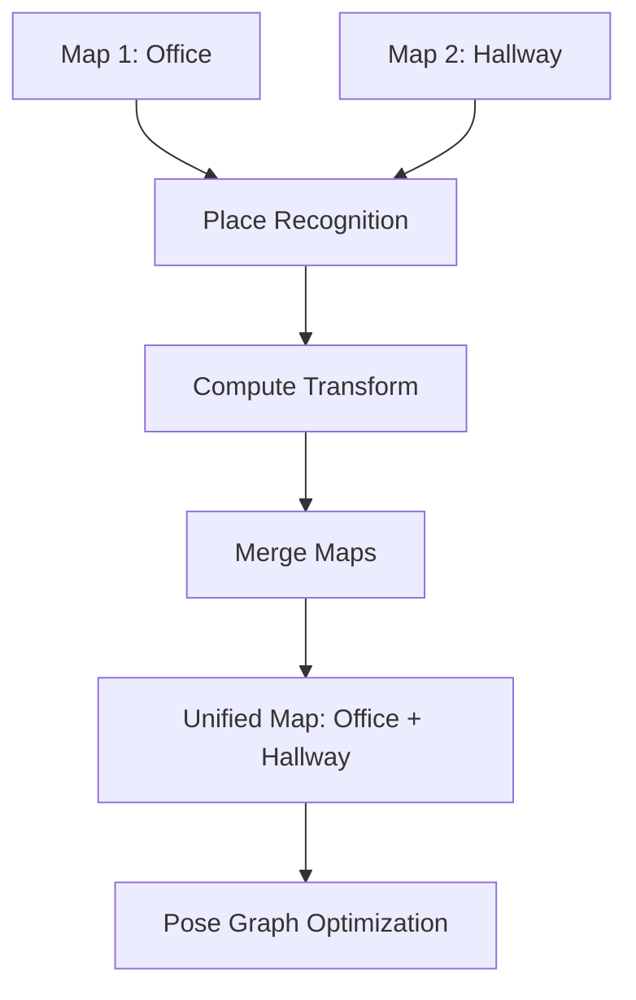

## Overview

ORB-SLAM3 features a sophisticated **multi-map system** called the **Atlas**, which can create, manage, and merge multiple independent maps within a single session. This capability enables robust long-term operation, seamless map merging, and recovery from tracking failures.

<Info>
The Atlas system was introduced in ORB-SLAM3 based on the research paper **"ORBSLAM-Atlas: a robust and accurate multi-map system"** (IROS 2019).
</Info>

## The Atlas Class

The Atlas is the core data structure managing all maps in the system.

**Definition:** `include/Atlas.h:49-166`

```cpp
class Atlas
{
public:
    Atlas();
    Atlas(int initKFid);
    
    void CreateNewMap();
    void ChangeMap(Map* pMap);
    Map* GetCurrentMap();
    
    void AddKeyFrame(KeyFrame* pKF);
    void AddMapPoint(MapPoint* pMP);
    
    vector<Map*> GetAllMaps();
    int CountMaps();
    
    bool isInertial();
    void SetInertialSensor();
    bool isImuInitialized();
    
    void SetMapBad(Map* pMap);
    void RemoveBadMaps();
    
    void clearMap();
    void clearAtlas();
    
protected:
    std::set<Map*> mspMaps;      // All active maps
    std::set<Map*> mspBadMaps;   // Deprecated maps
    Map* mpCurrentMap;            // Currently active map
};
```

## Key Concepts

### Active Map

The **active map** is the map currently being used for tracking and mapping.

```cpp
// Get the currently active map
Map* pActiveMap = mpAtlas->GetCurrentMap();

// Switch to a different map
mpAtlas->ChangeMap(pAnotherMap);
```

<Note>
Only one map is active at any given time. Tracking and local mapping operate on the active map.
</Note>

### Map States

Maps in the Atlas can be in different states:

<CardGroup cols={2}>
  <Card title="Active Map" icon="circle-check">
    Currently being used for tracking and mapping operations.
  </Card>
  <Card title="Inactive Maps" icon="circle-pause">
    Previously created maps stored in the Atlas, available for reactivation.
  </Card>
  <Card title="Bad Maps" icon="circle-xmark">
    Maps marked as bad due to insufficient data or errors, scheduled for removal.
  </Card>
</CardGroup>

## Multi-Map Workflows

### Scenario 1: Tracking Loss and Recovery

<Steps>
  <Step title="Tracking Lost">
    Camera loses track due to fast motion, occlusion, or entering an unknown area.
  </Step>
  <Step title="Create New Map">
    If relocalization fails, the Atlas creates a new map and reinitializes SLAM.
    ```cpp
    mpAtlas->CreateNewMap();
    ```
  </Step>
  <Step title="Continue Tracking">
    The system continues tracking in the new map while preserving the previous map.
  </Step>
  <Step title="Map Merging">
    When the system detects overlap between maps (via place recognition), they are merged.
  </Step>
</Steps>

### Scenario 2: Revisiting Locations

When the camera revisits a previously mapped area:

1. **Place Recognition** detects the known location
2. **Map Matching** identifies which inactive map corresponds to the location  
3. **Map Activation** switches the active map or merges maps
4. **Seamless Transition** continues SLAM operation without interruption

## Map Creation and Management

### Creating a New Map

```cpp
// Create new map (happens automatically on tracking failure)
void Atlas::CreateNewMap()
{
    Map* pNewMap = new Map();
    mspMaps.insert(pNewMap);
    mpCurrentMap = pNewMap;
    
    // Initialize map properties
    if (isInertial()) {
        pNewMap->SetInertialSensor();
    }
}
```

<Warning>
Creating a new map during operation indicates tracking was lost. The system automatically handles this to maintain robustness.
</Warning>

### Accessing Maps

<CodeGroup>
```cpp Get Current Map
// Get the currently active map
Map* pCurrentMap = mpAtlas->GetCurrentMap();

// Check map properties
long unsigned int nKeyFrames = pCurrentMap->KeyFramesInMap();
long unsigned int nMapPoints = pCurrentMap->MapPointsInMap();
```

```cpp Get All Maps
// Get all maps in the atlas
vector<Map*> vpAllMaps = mpAtlas->GetAllMaps();

// Count total maps
int nMaps = mpAtlas->CountMaps();

cout << "Atlas contains " << nMaps << " maps" << endl;
```

```cpp Add Elements to Map
// Add keyframe to current map
KeyFrame* pKF = new KeyFrame(...);
mpAtlas->AddKeyFrame(pKF);

// Add map point to current map
MapPoint* pMP = new MapPoint(...);
mpAtlas->AddMapPoint(pMP);
```
</CodeGroup>

## Inertial Map Properties

For visual-inertial SLAM, maps track additional IMU-related state:

```cpp
// Check if atlas uses inertial sensor
bool bUseIMU = mpAtlas->isInertial();

// Enable inertial sensor
mpAtlas->SetInertialSensor();

// Check IMU initialization status
if (mpAtlas->isImuInitialized()) {
    // IMU is initialized, scale and gravity are known
}
```

<Info>
**IMU Initialization:** Visual-inertial maps require 2-15 seconds of initialization to estimate scale, gravity direction, and velocity. The `isImuInitialized()` flag indicates when this process is complete.
</Info>

## Map Merging

Map merging is one of the most powerful features of the Atlas system.

### When Maps Merge

Maps are merged when:

1. **Loop Closure Detection** finds a connection between maps
2. **Place Recognition** identifies overlapping areas
3. **Sufficient Common Features** are found between maps

### Merging Process

<Steps>
  <Step title="Detect Overlap">
    Place recognition system identifies that the current location exists in an inactive map.
  </Step>
  <Step title="Compute Transformation">
    Calculate the relative transformation (rotation, translation, scale) between maps.
  </Step>
  <Step title="Merge Maps">
    Combine keyframes and map points from both maps into a single unified map.
  </Step>
  <Step title="Optimize">
    Perform pose graph optimization and bundle adjustment on the merged map.
  </Step>
  <Step title="Update Atlas">
    Remove the merged map and update the active map.
  </Step>
</Steps>



<Check>
**Seamless Fusion:** Map merging happens automatically without user intervention, creating a unified map with globally consistent poses.
</Check>

## Map Persistence

ORB-SLAM3 supports saving and loading maps for reuse across sessions.

### Saving Maps

```cpp
// Save atlas to file (internal method)
void System::SaveAtlas(int type)
{
    // type: FileType::TEXT_FILE or FileType::BINARY_FILE
    
    // Serialize atlas including:
    // - All maps with keyframes and map points
    // - ORB vocabulary
    // - Camera parameters
}
```

### Loading Maps

```cpp
// Load atlas from file
bool System::LoadAtlas(int type)
{
    // Deserialize atlas and restore:
    // - Map structure
    // - Keyframe database
    // - Place recognition vocabulary
    
    return true; // if successful
}
```

<Tip>
**File Formats:** 
- `TEXT_FILE` (0): Human-readable but larger file size
- `BINARY_FILE` (1): Compact binary format for production use
</Tip>

## Camera and Map Association

### Multi-Camera Support

The Atlas manages cameras across different maps:

```cpp
// Add camera to atlas
GeometricCamera* pCamera = new Pinhole(vParameters);
GeometricCamera* pCamInAtlas = mpAtlas->AddCamera(pCamera);

// Get all cameras
std::vector<GeometricCamera*> vpCameras = mpAtlas->GetAllCameras();
```

**Camera registration:** Each unique camera model is stored once and shared across maps, defined in `include/Atlas.h:92-93`.

## Reference Map Points

```cpp
// Set reference map points for visualization
mpAtlas->SetReferenceMapPoints(vpRefMapPoints);

// Get reference map points
vector<MapPoint*> vpRefMPs = mpAtlas->GetReferenceMapPoints();
```

Reference map points are used by the viewer for visualization and represent the most reliable points in the map.

## Database Integration

### KeyFrame Database

The Atlas integrates with the keyframe database for place recognition:

```cpp
// Set keyframe database
mpAtlas->SetKeyFrameDababase(mpKeyFrameDB);

// Get keyframe database
KeyFrameDatabase* pKFDB = mpAtlas->GetKeyFrameDatabase();
```

### ORB Vocabulary

The ORB vocabulary is shared across all maps:

```cpp
// Set vocabulary
mpAtlas->SetORBVocabulary(mpVocabulary);

// Get vocabulary
ORBVocabulary* pVoc = mpAtlas->GetORBVocabulary();
```

## Statistics and Monitoring

<CodeGroup>
```cpp Map Statistics
// Current map statistics
long unsigned int nKFs = mpAtlas->KeyFramesInMap();
long unsigned int nMPs = mpAtlas->MapPointsInMap();

cout << "Current map: " << nKFs << " keyframes, " 
     << nMPs << " map points" << endl;
```

```cpp Atlas Statistics  
// Total atlas statistics
long unsigned int nTotalKFs = mpAtlas->GetNumLivedKF();
long unsigned int nTotalMPs = mpAtlas->GetNumLivedMP();

int nMaps = mpAtlas->CountMaps();

cout << "Atlas: " << nMaps << " maps, "
     << nTotalKFs << " keyframes, "
     << nTotalMPs << " map points" << endl;
```

```cpp Map Changes
// Detect big map changes (loop closure, map merge)
int nLastChange = mpAtlas->GetLastBigChangeIdx();

// Inform atlas of new change
mpAtlas->InformNewBigChange();
```
</CodeGroup>

## Map Cleanup

### Removing Bad Maps

```cpp
// Mark a map as bad
mpAtlas->SetMapBad(pMap);

// Remove all bad maps from atlas
mpAtlas->RemoveBadMaps();
```

### Clearing Data

<CodeGroup>
```cpp Clear Current Map
// Clear the current active map
mpAtlas->clearMap();
```

```cpp Clear Entire Atlas
// Clear all maps and reset atlas
mpAtlas->clearAtlas();
```
</CodeGroup>

<Warning>
Clearing operations are destructive and cannot be undone. Use with caution.
</Warning>

## Serialization

The Atlas supports Boost serialization for save/load operations:

```cpp
template<class Archive>
void serialize(Archive &ar, const unsigned int version)
{
    ar.template register_type<Pinhole>();
    ar.template register_type<KannalaBrandt8>();
    
    ar & mvpBackupMaps;   // Vector of maps
    ar & mvpCameras;      // Cameras
    ar & Map::nNextId;    // Static IDs
    ar & Frame::nNextId;
    ar & KeyFrame::nNextId;
    ar & MapPoint::nNextId;
    ar & GeometricCamera::nNextId;
    ar & mnLastInitKFidMap;
}
```

This enables complete restoration of the Atlas state including all maps and their associations.

## Best Practices

<AccordionGroup>
  <Accordion title="Map Management Strategy">
    - **Let the system handle map creation** automatically on tracking loss
    - **Don't manually switch maps** unless you have a specific reason
    - **Monitor map statistics** to understand system behavior
    - **Save maps periodically** for long-term applications
  </Accordion>

  <Accordion title="Memory Management">
    - Each map consumes memory for keyframes and map points
    - Bad maps are automatically cleaned up
    - For long sessions, consider saving and clearing old maps
    - Merged maps free memory from the absorbed map
  </Accordion>

  <Accordion title="Inertial Considerations">
    - Each new inertial map requires 2-15 seconds for IMU initialization
    - Scale consistency is maintained across merged maps
    - Check `isImuInitialized()` before relying on metric scale
  </Accordion>

  <Accordion title="Place Recognition">
    - Map merging depends on reliable place recognition
    - Ensure good visual overlap between environments
    - Loop closure quality affects merge quality
  </Accordion>
</AccordionGroup>

## Use Cases

<CardGroup cols={2}>
  <Card title="Long-Term Operation" icon="clock">
    Robot operating over multiple days/weeks, automatically managing maps as it explores new areas.
  </Card>
  <Card title="Exploration and Mapping" icon="map">
    Creating separate maps for different floors or buildings, merging when overlap is detected.
  </Card>
  <Card title="Recovery from Failure" icon="rotate-right">
    Automatically recovering from tracking loss by creating a new map, then merging when possible.
  </Card>
  <Card title="Multi-Session SLAM" icon="folder-tree">
    Saving maps from previous sessions and merging them with new explorations.
  </Card>
</CardGroup>

## Related Topics

<CardGroup cols={2}>
  <Card title="SLAM Overview" icon="map-location-dot" href="/concepts/slam-overview">
    Understand the overall SLAM architecture
  </Card>
  <Card title="System API" icon="code" href="/api-reference/system">
    System class methods for map management
  </Card>
  <Card title="Loop Closing" icon="arrows-spin" href="/advanced/loop-closing">
    How loop closure triggers map merging
  </Card>
  <Card title="Save/Load Maps" icon="floppy-disk" href="/guides/save-load-maps">
    Guide to persisting maps across sessions
  </Card>
</CardGroup>

## Technical Details

### Thread Safety

The Atlas class uses mutexes for thread-safe operation:

```cpp
std::mutex mMutexAtlas;  // Protects map modifications
```

All public methods are thread-safe and can be called from tracking, mapping, or loop closing threads.

### Map ID Tracking

```cpp
unsigned long int mnLastInitKFidMap;  // Last initialization keyframe ID

unsigned long int GetLastInitKFid();
```

Tracks the last keyframe ID used for map initialization, useful for debugging and map versioning.

## Performance Considerations

- **Memory:** Each map stores keyframes (poses + features) and map points (3D positions)
- **Computation:** Map merging involves pose graph optimization (expensive but infrequent)
- **Real-time:** Active map operations are optimized for real-time performance
- **Scaling:** System tested with multiple maps totaling thousands of keyframes