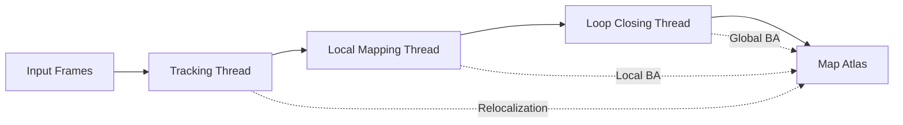

## What is SLAM?

Simultaneous Localization and Mapping (SLAM) is a computational problem where a robot or autonomous system must build a map of an unknown environment while simultaneously keeping track of its location within that environment.

ORB-SLAM3 is a **real-time SLAM library** that performs Visual, Visual-Inertial, and Multi-Map SLAM with monocular, stereo, and RGB-D cameras.

## Core Architecture

ORB-SLAM3 consists of four main parallel threads that work together to achieve robust tracking and mapping:

<CardGroup cols={2}>
  <Card title="Tracking" icon="video">
    Processes every frame to compute the camera pose by matching features with the local map. Decides when to insert keyframes.
  </Card>
  <Card title="Local Mapping" icon="layer-group">
    Manages the local map and performs local bundle adjustment to refine the camera poses and 3D point positions.
  </Card>
  <Card title="Loop Closing" icon="arrows-spin">
    Detects loops with every new keyframe and performs pose graph optimization when a loop is found.
  </Card>
  <Card title="Map Management" icon="atlas">
    Handles multiple maps, map merging, and atlas management for seamless multi-session SLAM.
  </Card>
</CardGroup>

## System Components

### ORB Feature Extraction

ORB-SLAM3 uses **ORB (Oriented FAST and Rotated BRIEF)** features for visual tracking:

- **Scale invariance**: Multi-scale pyramid for robust feature detection
- **Rotation invariance**: Oriented features handle camera rotation
- **Computational efficiency**: Real-time performance on standard CPUs

### Place Recognition

The system uses **DBoW2** (Bag of Binary Words) for:
- Loop closure detection
- Relocalization after tracking loss
- Map matching for multi-map scenarios

### Graph Optimization

ORB-SLAM3 leverages **g2o** for non-linear optimization:
- Local bundle adjustment in mapping thread
- Pose graph optimization after loop closure
- Full bundle adjustment for map refinement

## Thread Architecture



<Info>
The **Tracking thread** runs in the main execution thread, while Local Mapping, Loop Closing, and Viewer run in separate threads for parallel processing.
</Info>

## Key Features

<AccordionGroup>
  <Accordion title="Visual-Only Tracking">
    Robust monocular, stereo, and RGB-D SLAM without inertial sensors. Achieves accurate 6-DOF camera pose estimation using visual features alone.
  </Accordion>

  <Accordion title="Visual-Inertial Fusion">
    Integrates IMU measurements at frame rate for improved robustness, especially during fast motion, occlusions, or texture-poor environments.
  </Accordion>

  <Accordion title="Multi-Map System">
    Creates and manages multiple maps in the same session. Automatically merges maps when common areas are detected.
  </Accordion>

  <Accordion title="Map Reuse">
    Supports loading previously created maps and continuing SLAM in known environments.
  </Accordion>
</AccordionGroup>

## Tracking States

The system can be in different tracking states managed through the `System` class:

- **OK**: Successfully tracking the current map
- **LOST**: Tracking lost, attempting relocalization
- **RECENTLY_LOST**: Tracking recently lost, using motion model
- **NOT_INITIALIZED**: System not yet initialized

## Operating Modes

### SLAM Mode (Default)

```cpp
System SLAM(strVocFile, strSettingsFile, System::STEREO, true);
// Full SLAM: tracking + mapping + loop closing
```

The system simultaneously builds the map and localizes the camera.

### Localization-Only Mode

```cpp
SLAM.ActivateLocalizationMode();
// Only tracking, no mapping
```

<Warning>
In localization mode, the local mapping thread is stopped. The system only tracks the camera pose without updating the map.
</Warning>

## System Initialization

The `System` class is the main entry point defined in `include/System.h:83-265`:

```cpp
System(const string &strVocFile, 
       const string &strSettingsFile, 
       const eSensor sensor, 
       const bool bUseViewer = true, 
       const int initFr = 0, 
       const string &strSequence = std::string());
```

**Parameters:**
- `strVocFile`: Path to ORB vocabulary for place recognition
- `strSettingsFile`: YAML configuration file with camera and sensor parameters
- `sensor`: Sensor mode (see [Sensor Modes](/concepts/sensor-modes))
- `bUseViewer`: Enable/disable visualization

## Performance Characteristics

<CardGroup cols={3}>
  <Card title="Accuracy" icon="bullseye">
    Significantly more accurate than other open-source SLAM systems across all sensor configurations.
  </Card>
  <Card title="Robustness" icon="shield">
    As robust as the best systems available in the literature, handles challenging scenarios.
  </Card>
  <Card title="Real-time" icon="bolt">
    Runs in real-time on modern CPUs (e.g., Intel i7) for live applications.
  </Card>
</CardGroup>

## Related Concepts

<CardGroup cols={2}>
  <Card title="Sensor Modes" icon="camera" href="/concepts/sensor-modes">
    Learn about different sensor configurations supported by ORB-SLAM3
  </Card>
  <Card title="Multi-Map System" icon="layer-group" href="/concepts/multi-map-system">
    Understand the Atlas and multi-map capabilities
  </Card>
  <Card title="Camera Models" icon="aperture" href="/concepts/camera-models">
    Explore pinhole and fisheye camera models
  </Card>
  <Card title="IMU Integration" icon="gauge" href="/concepts/imu-integration">
    Deep dive into visual-inertial fusion
  </Card>
</CardGroup>

## Next Steps

<Steps>
  <Step title="Choose Your Sensor Mode">
    Review the [Sensor Modes](/concepts/sensor-modes) page to understand which configuration matches your hardware.
  </Step>
  <Step title="Configure Your Camera">
    Set up your camera calibration file following the [Camera Models](/concepts/camera-models) guide.
  </Step>
  <Step title="Build the System">
    Follow the [Building from Source](/getting-started/building) guide to compile ORB-SLAM3.
  </Step>
</Steps>